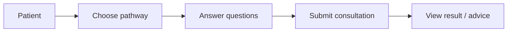
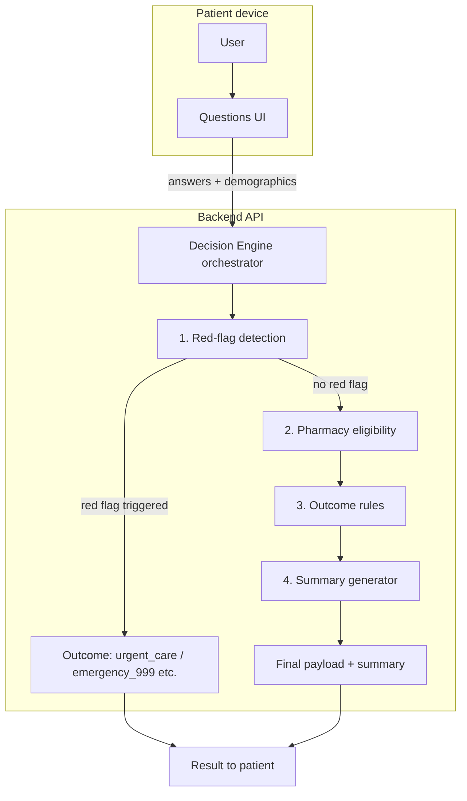
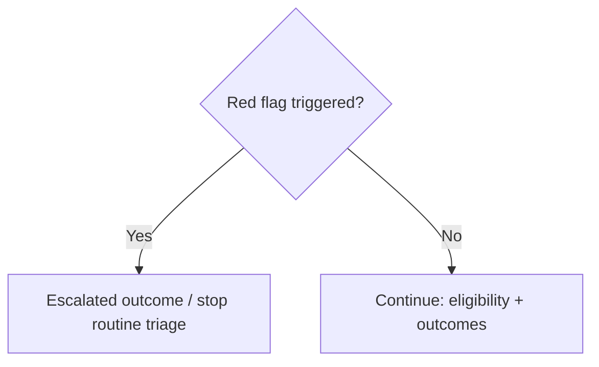

# Patient Flow, Conditions, Outcomes & UI — Finalization Spec

**Status:** Finalized baseline for product, clinical flow, and frontend planning.  
**Related:** [clinical_rules_explained.md](./clinical_rules_explained.md), [alignment-and-planning.md](./alignment-and-planning.md), [milestone-plan.md](./milestone-plan.md)

---

## 1. Conditions list (seven pathways)

Canonical `pathwayCode` values match **`frontend/pages/index.tsx`** (landing selection) and **`frontend/pages/consultation.tsx`** (`PATHWAY_LABELS` / `PATHWAY_QUESTIONS` where defined).

| # | `pathwayCode` | Short label (UI) | Full clinical label | Patient-facing description (landing) |
|---|---------------|------------------|---------------------|--------------------------------------|
| 1 | `uti` | UTI | Urinary Tract Infection | Painful or frequent urination |
| 2 | `sore_throat` | Sore Throat | Sore Throat | Throat pain, difficulty swallowing |
| 3 | `sinusitis` | Sinusitis | Sinusitis | Blocked nose, facial pressure |
| 4 | `otitis_media` | Ear Infection | Ear Infection | Ear pain, discharge |
| 5 | `insect_bites` | Insect Bite | Infected Insect Bite | Redness, swelling at bite site |
| 6 | `impetigo` | Impetigo | Impetigo | Crusty, golden sores on skin |
| 7 | `shingles` | Shingles | Shingles | Painful rash on one side |

**Note:** Consultation questions today are **fully defined in frontend** for `uti`, `sore_throat`, `sinusitis`, `shingles`; other codes use **`DEFAULT_QUESTIONS`** until pathway JSON + server-driven flow land (see [milestone-plan.md](./milestone-plan.md) Epic E-03 / E-04).

---

## 2. Outcomes (canonical system codes)

The **decision engine** (`backend/engine/decisionEngine.js`) uses **five** outcome codes. Patient copy can group “emergency” into two levels (999 vs urgent care).

| System code | Patient-friendly label | Meaning (summary) |
|-------------|------------------------|---------------------|
| `self_care` | **Self-care** | Advice and self-management; no referral required |
| `pharmacy` | **Pharmacy** | Pharmacy First / pharmacist-led pathway where eligible |
| `gp` | **GP** | GP practice review or appointment recommended |
| `urgent_care` | **Urgent care** | Same-day urgent service (not 999); distinct from routine GP |
| `emergency_999` | **Emergency (999)** | Life-threatening or severe — call **999** / emergency care |

**Mapping “four outcomes” wording to five codes**

If stakeholders use only **Self-care | Pharmacy | GP | Emergency**, use:

- **Emergency** → split into **`urgent_care`** (urgent, not necessarily 999) and **`emergency_999`** (999). UI must not conflate the two.

**UI / icon alignment**

| Code | Shared UI | File |
|------|-----------|------|
| All five | `TriageOutcomeIcon` | `frontend/lib/triageOutcomeIcons.tsx` |
| Result page | Outcome hero + copy | `frontend/pages/result.tsx` |

---

## 3. System flow (diagrams)

### 3.1 Patient-visible journey (simple narrative)

High-level story for documentation and training — **not** the internal safety order.



### 3.2 Authoritative technical pipeline (safety-correct)

**Red-flag detection runs first inside the Decision Engine** — before pharmacy eligibility and before routine outcome rules. This matches `backend/engine/decisionEngine.js` and [clinical_rules_explained.md](./clinical_rules_explained.md).



**Important correction to a linear phrase**

A phrase like *“User → Questions → Decision Engine → Red Flag → Outcome”* is **misleading** if it implies red-flag runs **after** other engine logic. Correct statement:

- **User → Questions → submit to Decision Engine → inside engine: Red Flag first → then eligibility → then outcome → summary → Outcome shown to user.**

### 3.3 Red flag “overrides” (logic)



---

## 4. Roles (product & UI)

| Role | Responsibility | Current UI / route (match before build) |
|------|----------------|----------------------------------------|
| **Patient** | Select pathway, complete questionnaire, read outcome, emergency signposting | `/` → `/consultation?pathway=…` → `/result` (and API `POST /api/consultation`) |
| **Admin** | Pathways overview, analytics-style views, rules visibility (MVP varies) | `/admin/dashboard` |
| **Pharmacist** | Review pharmacy-referred cases, update status, print | `/pharmacist/dashboard` |

**Additional (operational, not in your three-role list)**

| Role | Route | Notes |
|------|-------|--------|
| **CRM staff** | `/crm`, `/crm/patients`, cases, tasks, comms | Operational; keep separate from “Pharmacist” panel unless you merge personas later |

---

## 5. Design baseline — match current UI before development

Use this as the **reference surface** so new work (chatbot layout, branching) does not drift from tokens and patterns already in the repo.

| Area | Reference implementation | Patterns to preserve |
|------|--------------------------|----------------------|
| **Landing** | `frontend/pages/index.tsx` | `bg-gradient`, `bg-card`, `border-border`, `primary` / `brand-header`, consent + pathway grid, emergency strip, footer links |
| **Consultation** | `frontend/pages/consultation.tsx` | Progress indicator, one question per step, red-flag hint styling (`TriangleAlert`), patient demographics step, submit to API |
| **Result** | `frontend/pages/result.tsx` | `TriageOutcomeIcon`, outcome config, safety copy, print/email affordances |
| **Admin** | `frontend/pages/admin/dashboard.tsx` | Tabs, `bg-card`, KPI-style blocks |
| **Pharmacist** | `frontend/pages/pharmacist/dashboard.tsx` | Case list + detail split, status actions |
| **Global tokens** | `frontend/styles/globals.css`, `tailwind.config.js` | Semantic colours, `card`, `muted`, `primary`, `brand-header` |

**Before changing layout:** capture screenshots or a short Loom of the above routes as **UI baseline v1**.

---

## 6. Frontend planning — multi-step & conditional questions

### 6.1 Target experience

| Feature | Today | Target (aligned to [alignment-and-planning.md](./alignment-and-planning.md)) |
|---------|--------|------------------|
| **Shape** | Wizard-style steps (progress bar, one question per view) | **Chatbot-like** vertical transcript: bot prompt bubbles + patient answer chips / inputs; optional “compact” mode for accessibility |
| **Conditionality** | Linear `PATHWAY_QUESTIONS[pathway]` array | **Server-driven** next question: branch depends on answers; client requests next step with `sessionId` + `answer` |
| **Red flags** | Hints on some questions; engine decides on submit | Optional **mid-flow** stop if server returns `flowTerminated: true` + emergency messaging |
| **Trust** | Client holds full question list for some pathways | **Do not** ship full branching graph to client for unreleased pathways; server is source of truth |

### 6.2 Frontend components (planned decomposition)

| Component | Responsibility |
|-----------|----------------|
| `ConsultationShell` | Layout: header, scroll area, footer CTA, error banner |
| `MessageThread` | Renders ordered list of `Step` items (assistant / user / system) |
| `QuestionRenderer` | Maps `type` (`boolean`, `select`, `text`, …) to controls; `aria-*` per field |
| `OutcomeGate` | Handles terminal state from server (999 / urgent / end) |
| `useConsultationSession` | Hook: `sessionId`, `postAnswer`, `undo` (if allowed), loading / error |

### 6.3 API contract (target — document only until backend exists)

Example shape for **conditional** flow (names illustrative):

```http
POST /api/consultation/session        { pathwayCode, patient? }
POST /api/consultation/session/:id/answer   { questionId, value }
GET  /api/consultation/session/:id          → { messages[], currentQuestion?, terminal?: { outcome, ... } }
```

### 6.4 Acceptance checks (frontend)

1. Keyboard-only user can complete **happy path** and **red-flag path** on one MVP pathway.
2. Focus management: new assistant message receives `aria-live="polite"`; trap focus only in modals (e.g. hard stop for 999).
3. **No layout shift** when loading next question (skeleton or fixed min-height bubble area).

---

## 7. Document control

| Version | Date | Summary |
|---------|------|---------|
| 1.0 | 2026-04-22 | Finalized 7 conditions, 5 outcomes, flows, roles, UI baseline, frontend plan |

---

## 8. Cross-links in other docs (optional)

When editing [alignment-and-planning.md](./alignment-and-planning.md), add this file to the “Related documents” table if not already linked.
